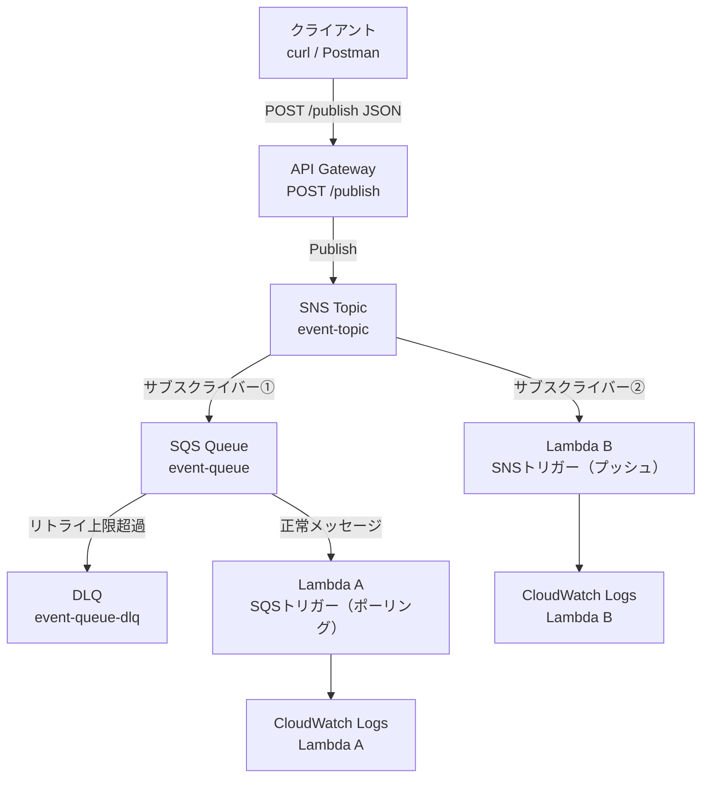
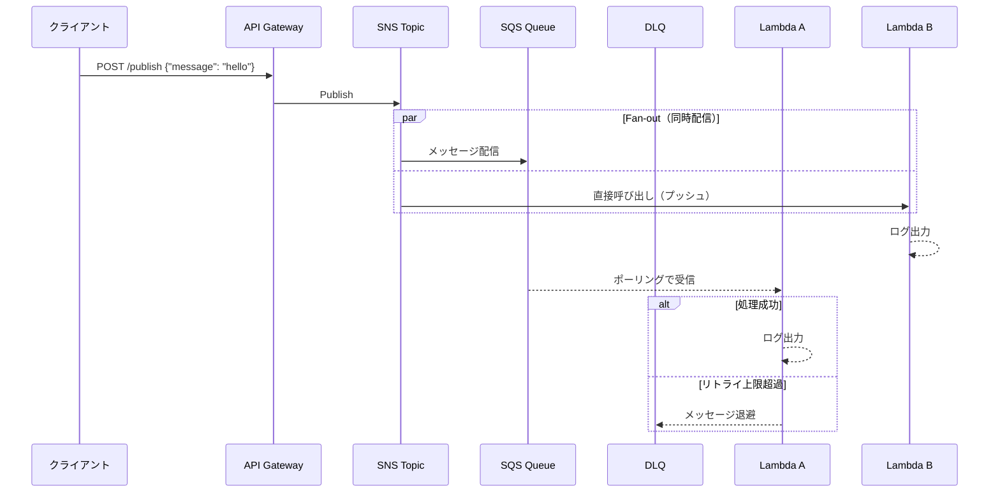

# アーキテクチャ構成図

## 全体構成



## メッセージフロー詳細



## コンポーネント詳細

### API Gateway

- エンドポイント：`POST /publish`
- リクエスト形式：`{"message": "任意の文字列"}`
- SNS への直接統合（Lambda を経由しない）

### SNS Topic

- タイプ：Standard
- サブスクライバー：SQS Queue、Lambda B の 2 つ
- Fan-out により両方へ同時配信

### SQS Queue

- タイプ：Standard
- 可視性タイムアウト：30 秒
- 最大受信回数：3 回（超過で DLQ へ移動）
- Lambda A がポーリングで取得

### DLQ（Dead Letter Queue）

- Lambda A が 3 回失敗したメッセージを受け取る
- 調査・手動リドライブに使用

### Lambda A

- トリガー：SQS
- 処理：受け取ったメッセージを CloudWatch Logs に出力
- （今後追加）`"fail": true` のメッセージで意図的に例外を投げる

### Lambda B

- トリガー：SNS（プッシュ型）
- 処理：受け取ったメッセージを CloudWatch Logs に出力
- バッファリングなし、DLQ なし

## Queue と Pub/Sub の違いが見えるポイント

```
[Pub/Sub の観点]
SNS → Lambda B
  ・SNS がプッシュ型で即時起動
  ・バッファなし
  ・サブスクライバーが増えても SNS 側の変更不要

[Queue の観点]
SNS → SQS → Lambda A
  ・Lambda A がポーリングで受信（プル型）
  ・SQS がバッファとして機能（Lambda が落ちてもメッセージは消えない）
  ・リトライ・DLQ による障害対応が可能
  ・FIFO キューに切り替えると順序保証も可能
```
